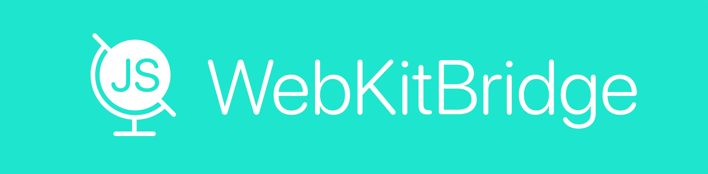

# WebKitBridge

Package for working with `WKWebView` and for communicating between JS and Swift.

## How to use

### Swift -> JS (OutcomeEvent)

1. Implement protocol `WebKitBridgeOutcomeEvent` with function `getScript()`. Just return JS code in it as proper String.
2. Inside `WebKitBridgeViewController` call method `run(outcomeEvent:)` and pass your protocol implementation

### JS -> Swift (IncomeEvent)

1. Implement protocol `WebKitBridgeIncomeEvent`. 
2. When initalize `WebKitBridgeViewController` pass real `WebKitBridgeIncomeEventsManager` with events (for example `WebKitBridgeBaseIncomeEventsManager`).
3. React on method `fire` in protocol `WebKitBridgeIncomeEvent` implementation.

## Configuration

- `designConfiguration` - config for design
- `linkURL` - url to open
- `spinnerManagerType` - type of entity, that will be initialized to display/hide spinner
- `incomeEventsManager` - entity for creating and managing income events
- `viewsProvider` - entity for creating loading/reachability/error views
- `reachabilityService` - entity for providing info about reachability

## WebKitBridgeViewController

Controller, that containt `WKWebview`.

### Method to override

- `domContentLoaded` - called when dom contend loaded (like `viewDidAppear`) 

## AllPageReloaderManager

Manager for reloading all webviews.
